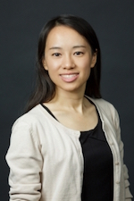

# Statistical Methods for Medical Image Analysis

## Tutorial Instructors:

- **Dr. Christos Davatzikos**, Professor of Radiology, University of Pennsylvania

Dr. Davatzikos is the Wallace T. Miller Sr. Professor of Radiology at the University of Pennsylvania. He is also Director of the Center for Biomedical Image Computing Analysis and Director of the Section of Biomedical Image Analysis at Penn. He was named a Fellow of the Institute of Electrical and Electronics Engineers (IEEE) in 2014.

- **Dr. Kristin Linn**, Assistant Professor of Biostatistics, University of Pennsylvania

Dr. Linn is an Assistant Professor of Biostatistics at Penn. She earned her PhD in statistics from North Carolina State University. Her research focuses on adapting and applying statistical methods to multimodal brain imaging. Her work incorporates ideas from causal inference and machine learning to reduce the effects of confounding and improve the interpretability and generalizability of estimated multivariate disease patterns.

- **Dr. Russell Taki Shinohara**, Assistant Professor of Biostatistics, University of Pennsylvania

Dr. Shinohara is an Assistant Professor of Biostatistics at Penn. He earned his PhD in Biostatistics from the Johns Hopkins University.  Dr. Shinohara works in neuroimaging statistics, high-dimensional data, and causal inference. His laboratory focuses on statistical methods for biomedical imaging with applications in multiple sclerosis, Alzheimer’s disease, depression, post-traumatic stress disorder, autism spectrum disorders, and brain development. 

- **Dr. Haochang Shou**, Assistant Professor of Biostatistics, University of Pennsylvania

Dr. Shou joined Penn as an Assistant Professor of Biostatistics after completing her PhD in Biostatistics at the Johns Hopkins University. Her research focuses on statistical methods for high-dimensional data with complex temporal or spatial structures, particularly multimodal imaging from mental health studies. She has contributed methods to quantify variability and extract features from MRI and diffusion tensor imaging, assess reproducibility and correct measurement error for functional connectivity maps, and predict disease outcomes using imaging markers.

- **Dr. Simon Vandekar**, Assistant Professor of Biostatistics, Vanderbilt University

Dr. Vandekar will be joining the Department of Biostatistics at Vanderbilt University in Summer 2018 as an Assistant Professor. He earned his PhD in Biostatistics from the University of Pennsylvania. Dr. Vandekar has developed techniques for multi-modal imaging data analysis and statistical methods that address issues of multiple hypothesis testing with neuroimaging data. He has applied these methods to study neurodevelopment and Alzheimer's disease.

## Tentative Schedule:

### Module 1. Statistical Assessment of Scan-Rescan Reliability (Shou)

- We will demonstrate the importance of assessing scan-rescan reproducibility of imaging data, especially in functional connectivity 
- We will discuss various metrics available that are suitable for imaging reliability assessment based on modality. 
- We will introduce statistical approaches that reduce biases caused by large scan-to-scan variations.

### Module 2. Multi-scanner Harmonization of Imaging Data and Replicability Analysis (Shinohara)

- We will summarize the literature documenting biases in imaging measurements and biomarkers arising from differences across imaging protocol, scanners, and sites.
- We will discuss classical and state-of-the-art approaches for mitigating inter-scanner differences. Many of these approaches draw from the statistical literature on batch effects in genomic and gene expression analysis. 
- We will discuss replicability analysis methods for benchmarking feature extraction and image harmonization approaches.

### Break

### Module 3. Multiple Comparison Correction (Vandekar)

- We will define formal hypothesis testing and motivate the problem of false positives due to multiple comparisons.
- We will define the family wise error rate (FWER) and false discovery rate (FDR) and discuss their differences.
- We will review common FWER techniques used with imaging data such as Bonferroni correction, random field theory, and permutation testing.
- We will discuss cluster-extent based thresholding.
- If time permits, we will cover recent projection-based methods for multiple testing and a parametric bootstrap approach that decreases computation time for permutation testing.

### Module 4. Confounding and Multivariate Pattern Analysis (Linn)

- We will illustrate how multivariate pattern analyses based on observational imaging data can be biased if there is confounding by non-imaging variables such as age and sex. 
- We will discuss univariate and other methods that aim to address this type of confounding.
- We will introduce an approach based on inverse probability weighting using propensity scores and demonstrate its effectiveness at reducing bias.

### Module 5. Statistical Significance Maps for Machine Learning Methods (Davatzikos)

- We will present methods for inference on weight maps derived from machine learning models. 
- We will discuss regional filtering and the effect of scale in which the statistical analysis is performed.

